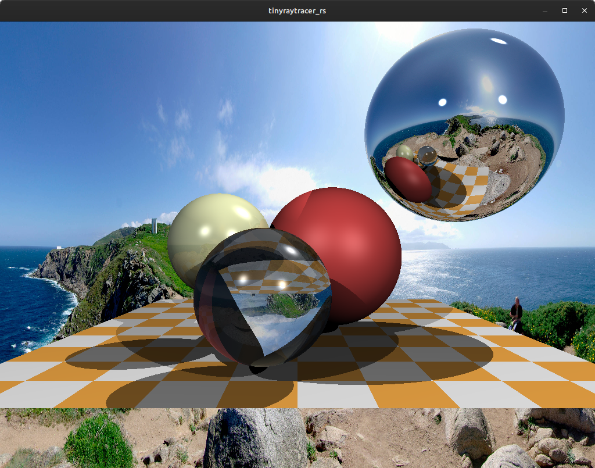

# tinyraytracer_rs
This repo consists of a Rust implementation of the [tinyraytracer](https://github.com/ssloy/tinyraytracer) walkthrough by professor Dmitry V. Sokolov. For a tinyrenderer Rust implementation, check the [tinyrenderer_rs](https://github.com/ema2159/tinyrenderer_rs) repo.

## Dependencies:
- image 0.24.5: Image loading and manipulation
- piston_window 1.127.0: Window to display rendered frames
- obj-rs 0.6: To retrieve information from .obj files
- nalgebra 0.31.4: For vector and matrix calculations

## Usage
To run, just clone any of the branches and execute `cargo run --release`. If the branch requires some assets, execute:

```
cargo run --release <assets directory>
```
where `<assets directory>` is the directory in which the  corresponding assets (like the env map or obj model) are. For example, to run *Step 10a* you must clone the branch and execute:

```
cargo run --release assets/
```
At the moment, if you want to use other assets, you would have to modify the respective assets names in main.


## Steps

### Step 1: Display image on window
Write to an image buffer and render it in a window.

**Branch:** [Step_1](https://github.com/ema2159/tinyraytracer_rs/tree/Step_1)

**Preview:**


### Step 2: Ray tracing
Basic ray tracing for single sphere.

**Branch:** [Step_2](https://github.com/ema2159/tinyraytracer_rs/tree/Step_2)

**Preview:**


### Step 3: Add more spheres
Add more spheres. Add basic materials support.

**Branch:** [Step_3](https://github.com/ema2159/tinyraytracer_rs/tree/Step_3)

**Preview:**


### Step 4: Diffuse lighting
Add diffuse lighting to scene objects.

**Branch:** [Step_4](https://github.com/ema2159/tinyraytracer_rs/tree/Step_4)

**Preview:**


### Step 5: Specular lighting
Add specular lighting to scene objects.

**Branch:** [Step_5](https://github.com/ema2159/tinyraytracer_rs/tree/Step_5)

**Preview:**


### Step 6: Shadows
Add shadows computation to scene objects.

**Branch:** [Step_6](https://github.com/ema2159/tinyraytracer_rs/tree/Step_6)

**Preview:**


### Step 7: Reflections
Add reflections computation to scene objects.

**Branch:** [Step_7](https://github.com/ema2159/tinyraytracer_rs/tree/Step_7)

**Preview:**


### Step 8: Reflections
Add refractions computation to scene objects.

**Branch:** [Step_8](https://github.com/ema2159/tinyraytracer_rs/tree/Step_8)

**Preview:**


### Step 9: Rectangle objects
Add finite and infinite plane primitives support.

**Branch:** [Step_9](https://github.com/ema2159/tinyraytracer_rs/tree/Step_9)

**Preview:**


### Step 10a: Environment mapping
Add environment mapping support.

**Branch:** [Step_10a](https://github.com/ema2159/tinyraytracer_rs/tree/Step_10a)

**Preview:**


### Step 10b: Obj models support
Add support for triangle primitives. Use that to render .obj models.

**Branch:** [Step_10b](https://github.com/ema2159/tinyraytracer_rs/tree/Step_10b)

**Preview:**

